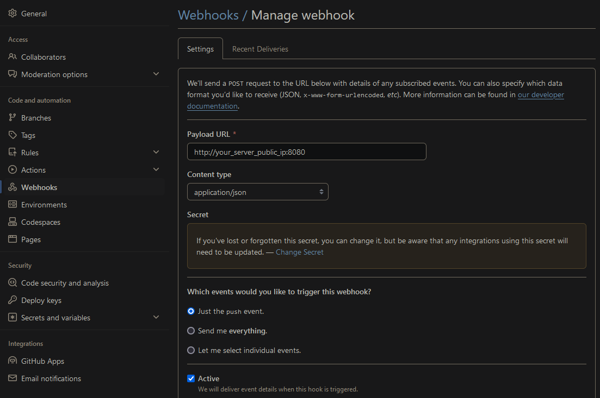

# Mkdocs-material custom container with nginx/basic auth/ssl - self signed/webhook for pushes and auto mkdocs rebuild

**The repo should be structured this way:**

```
.
├── docs/
│  └── index.md
|  └── <additional docs go here>
├── mkdocs.yml
├── mkdocs.sh
├── webhook.js
├── Dockerfile
├── nginx.conf
├── run.sh
├── README.md
```

***Some/all of these commands may require 'sudo' depending on your environment***

Clone the repo - replace 'PAT', 'username' and 'repo' to match (https://GEdsfasds38212fda@github.com/Xyic0re/mkdocs.git)
 - 'PAT' with personal access token
 - 'username' with your repo username
 - 'repo' with the repositories name

```bash
git clone https://<PAT>@github.com/<username>/<repo>.git && cd mkdocs
```
Public repo
```bash
git clone https://github.com/<username>/<repo>.git && cd mkdocs
```

**This container requires apache2-utils and openssl to generate the .htpasswd file and self signed ssl certificate:** 
  - 'run.sh' can use 'apt install' to install these.

## Running and setup

**Setup**

Create a Github webhook - if you're using ngrok replace 'Payload URL' with ngrok address eg: https://91f1-226-13-123-216.ngrok-free.app (without the 8080 since this is done in you ngrok setup)
 - make sure you have 8080 opened on you firewall or 443 if you're using ngrok
 - Content type: application/json
 - Secret: enter a secret for this webhook
 - Which events: just the push event
 - Active: tick


```bash
chmod +x run.sh && ./run.sh
```

**Running**
```bash
./run.sh
```