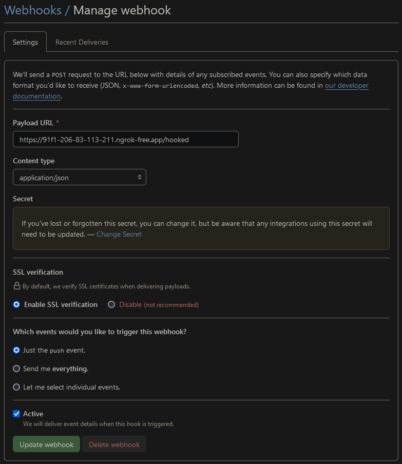

# Lightweight +-200MB Mkdocs-material docker container with nginx/basic auth/ssl - self signed/webhook for pushes and auto mkdocs rebuild

### https://squidfunk.github.io/mkdocs-material/

**The repo should be structured this way:**

```
.
├── docs/
│  └── index.md
|  └── <additional docs go here>
├── mkdocs.yml
├── mkdocs.sh
├── webhook.py
├── Dockerfile
├── nginx.conf
├── run.sh
├── README.md
```


**Clone and make it your own**

Clone the repo - replace 'PAT', 'username' and 'repo' to match (https://GEdsfasds38212fda@github.com/popbangshwang/mkdocs.git)
 - 'PAT' with personal access token
 - 'username' with your repo username
 - 'repo' with the repositories name

***This assumes your user ID is 1000***

```bash
sudo mkdir mydoco && sudo chown -R 1000:1000 mydoco
```

```bash
git clone -o upstream https://github.com/popbangshwang/mkdocs.git mydoco && cd mydoco
```

***on Github, create new repository called "mydoco"***

```bash
git remote add origin https://<PAT>@github.com/<username>/mydoco.git
```
```bash
git push -u origin master
```

***Some/all of these commands may require 'sudo' depending on your environment***

### Pre-requisites

This container requires apache2-utils and openssl to generate the .htpasswd file and self signed ssl certificate:
  - 'run.sh' can use 'apt install' to install these.

## Setup and Run

Create a Github webhook - if you're using ngrok replace 'Payload URL' with ngrok address eg: https://91f1-226-13-123-216.ngrok-free.app/hooked (without the 8080 since this is done in you ngrok setup)
 - webhook Payload URL - https//FQDN/hooked  - **/hooked is important**
 - make sure you have 8080 opened on you firewall
 - Content type: application/json
 - Secret: enter a secret for this webhook
 - Which events: just the push event
 - Active: tick


```bash
chmod +x run.sh && ./run.sh
```

**Run**
```bash
./run.sh
```

## Extras

 - replace nginx-certificate.crt with your own crt if you have it
 - mkdocs plugins can be installed - modify mkdocs.yml and Dockerfile for pip install <plugin>
